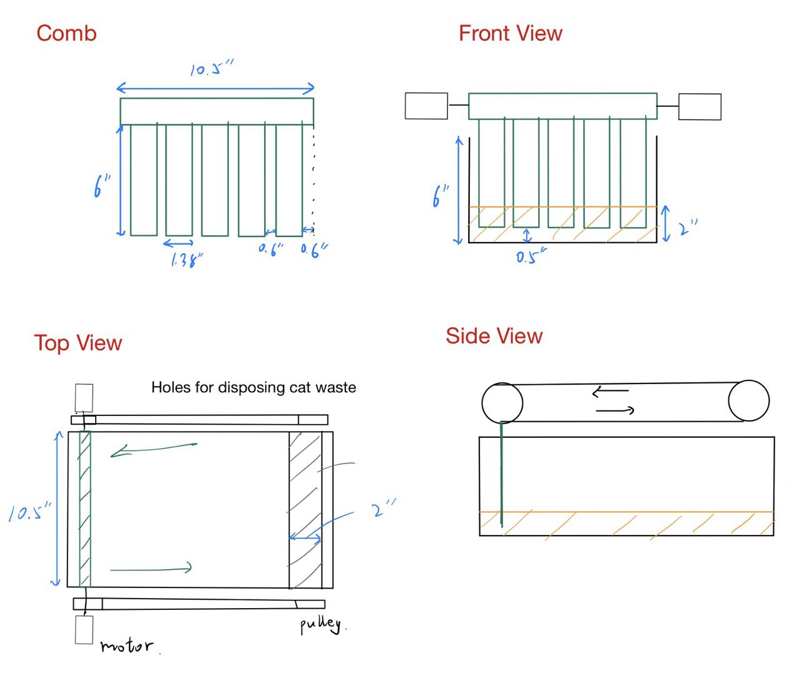

# Michael Worklog

## 09/11-09/17

- First TA meeting 
- Project Proposal
- Conversation with Machine Shop

## 09/18-09/24

- Second TA meeting
- Second conversation with Machine Shop
- CAD modeling of the Litter Box
- Revising Proposal

## 09/25-10/01
- Third TA meeting
- Finished the design document
- Drew the three-view drawing of the cat litter box, including the main dimensions and position of the comb

## 10/02-10/08

- Finished design review 
- Did research on odor sensors, chose and ordered MiCS-5914 as the sensor to detect ammonia concentration

## 10/09-10/15

- Did research on ESP32 programming
- Set up ESP-IDF SDK and Eclipse IDE

## 10/16-10/22

- Confirmed the connection method of each pin of the odor sensor on the PCB

- Conducted tests on the LM317 voltage regulator using an oscilloscope to successfully obtain 3.3V and 5V DC outputs
- Rewrited Design Document
  
## 10/23-10/29

- Researched and identified the ideal load resistance range (820 to 1164 ohms) for our project based on mathematical calculations
- Integrated the MiCS-5914 odor sensor with a breadboard and used SCOPY for voltage measurements. Exposed to ammonia in a humid environment, the sensor's output remained safely below 3.3V, confirming the ESP32 microcontroller's compatibility
- Finished Individual Progress Report

## 10/30-11/5

- Researched on the weight sensors, including four load cells and one HX711 ADC Interface
  
## 11/6-11/12

- Finished the code for odor sensor (ADC module). The driver code output the odor concentration to the serial monitor and output odor level 'Low' and 'High' to our app
- Helped with PCB soldering
- Bought ammonia liquid for future odor sensor testing 

## 11/13-11/19

- Mock demo
- Tested and calibrated the motor control system. The comb was moved forward and backward successfully, and we decided to set the raking time to around 26 seconds to rake the entire cat litter box

## 11/20-11/26
- Conducted a test on the odor sensor by exposing it to ammonia. Successfully connected all four pins and observed an increase in sensor readings when brought closer to the ammonia, confirming its functionality. Further calibration is needed for precision
- Worked on troubleshooting the weight sensor's software, updating the HX711 interface driver code. With adjustments, the sensor finally detected weight. Set the threshold at around 6kg (normal weight of a cat) using a bathroom scale and the serial monitor for a more reliable measure of the cat's litter box usage frequency 
  
## 11/27-12/3
- Final demo & Mock presentation
- Conducted comprehensive tests on our project. The odor sensor malfunctioned after inadvertently coming into contact with ammonia, and a wire pin became disconnected during testing. However, weight sensors and motors operated as expected. We set the threshold weight low enough for easy activation by hand during the final demo
- Developed and refined presentation slides

## 12/4-12/8
- Final presentation
- End of class
