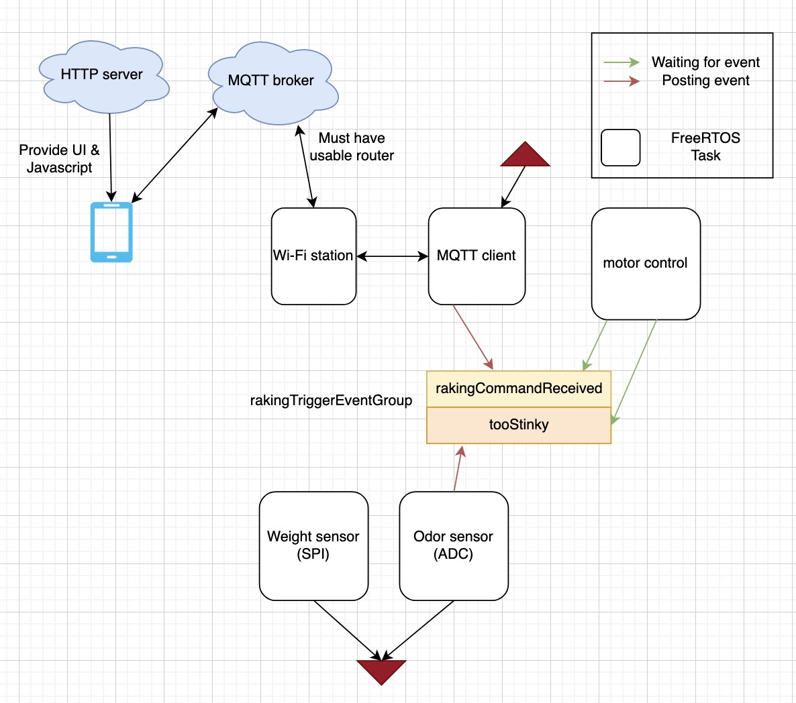
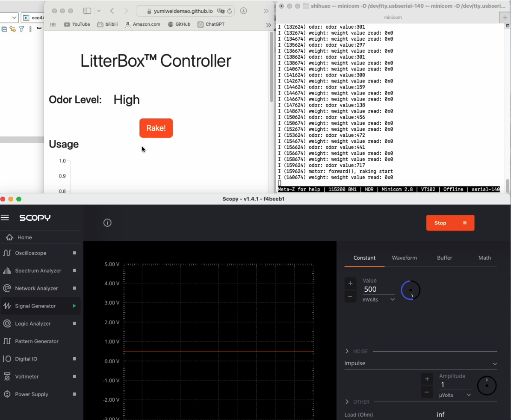

# Shihua Worklog

## 09/11-09/17
- Completed project proposal
- Initial conversation with machine shop

## 09/18-09/24

- Met with TA for mechanical design part and talked with machine shop again
- Finalized design block diagram
- Ordered weight sensor and ESP-C3 dev board for development
- Start learning about ESP-C3 bluetooth connectivity and peripherals that we need, such as SPI and ADC

## 09/25-10/01

- Ordered 12V DC motors and learn about encoders
- Worked on design document
- Purchased ESP32C3 dev kits for prototyping
- Installed and configured ESP-IDF SDK and Eclipse IDE for software dev

## 10/02-10/08

- Completed design review, switching from Bluetooth to Wi-Fi
- Finalized on software structure, made a software block diagram:

## 10/09-10/15

- Made a fully functional [web application](https://yumiweidemao.github.io/ece445-web-app/) running on a Github server. This includes UI and MQTT protocol functionalities. It can communicate with the ESP32C3 dev kit over the Internet.
- Completed code skeleton, hardware interaction to be added. (code can be found in [commit history](https://github.com/yumiweidemao/ECE445-Repo/commits/main))

## 10/16-10/22

- Started learning about the HX711 ADC serial interface and how to read weight value based on the sensor values
- Started writing code on weight sensor submodule, modified the read_weight_sensor() function so that it now utilizes GPIO4 and GPIO5 to communicate to HX711 through SCK and DOUT. Testing and calibration still needed in the future.

## 10/23-10/29

- Picked up the completed litter box from machine shop and tested the motor functions in lab using the +12V DC power supply. The two motors are connected in reverse directions by machine shop, so we need to be careful when connecting the motors to H-bridge (the input to one motor should be reversed to the other)
- Confirmed that the motor will likely have enough torque to push the sand, next step is to wait for the PCB, and try to control the motor and read encoder values using the MCU.

## 10/30-11/5

- Nothing particular. Still waiting for the components to come in order to perform further tests.

## 11/6-11/12

- Components have arrived and Jonathan is working on soldering and PCB testing. I'm waiting for the completion of the PCB.
- Michael finished the code for odor sensor (ADC module). I tested the functionality of the odor sensor using Scopy. I generated a 500mV DC signal and tried reading it from the ESP32C3. The expected value is ~620. The actual reading was about 700, which was good enough and showed that the ADC module worked correctly. Next step is to solder the odor sensor to the PCB and test using real ammonia.

- Completed motor control logic. When rake() is triggered, GPIO6 & GPIO7 will go through the following cycle to conduct a full raking:
**on/off(5s) --> off/off(1.5s) --> off/on(5s) --> off/off**
  This was also tested to work correctly using an oscilloscope. Next step is to test on the PCB and use voltmeter to see if output is correct.

## 11/13-11/19

- Tested motor control subsystem functionality by connecting 110V AC to the PCB, connecting the motors to H-bridge output, connecting the ESP32C3 dev kit to my phone hotspot, and pressing 'rake' button on the phone web app. The motor successfully completed a single back-and-forth rake, confirming the success of the power & motor subsystems as well as relevant parts of the communication subsystem.
- Tested weight sensor using an off-the-shelf HX711 ADC module, but weight value could not be correctly read. It could be a software issue, I'm still working on inspecting the code and debugging using an oscilloscope.

## 11/20-11/26

- Tested the GPIO behavior when ESP32C3 is in download mode. GPIO 6 & 7 floats when in download mode, which is pretty dangerous because it would be possible to cause a short circuit in the H-bridge circuit. After identifying the issue, external 10k pull-down resistors were added to the GPIO pins to ensure safety.

## 11/27-12/3

- After PCB completion, the functionalities were tested. We were able to load a program to the ESP32 microcontroller on the PCB through D+ D- pins (instead of USB-UART bridge that was originally designed to be used). The weight sensor and the motor subsystem worked fine. We couldn't get the odor sensor to work correctly so we gave up because there was little time left.
- Changed raking auto-triggering mechanism from odor-triggered to usage-triggered. Now, raking will be triggered 6 seconds after the weight sensor detects that the cat has left the litter box.
- Work on presentation & final paper
